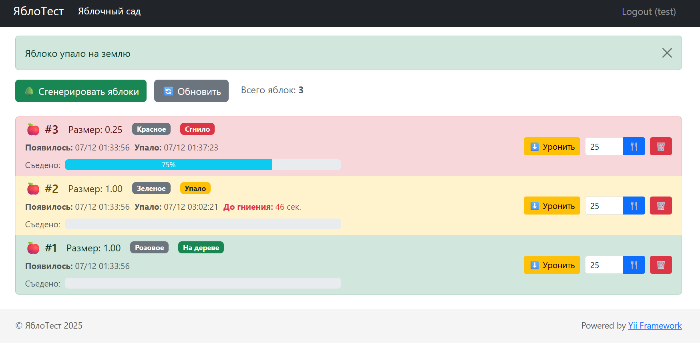

Установка
```
git clone https://github.com/SergeyTimakov86/test-apple.git
cd test-apple
composer install
docker compose up -d
docker exec app /bin/sh rollup.sh
```
Запуск

http://localhost в браузере

